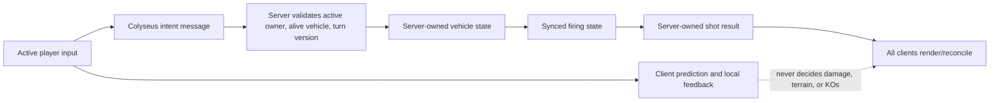
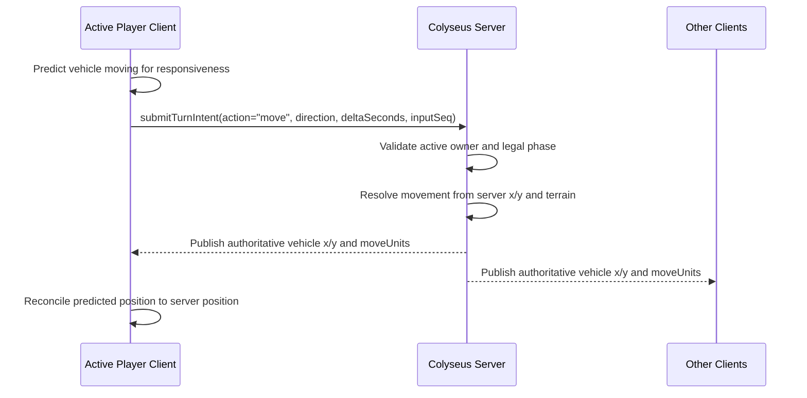

# Authoritative Move And Fire Flow Design

## Goal

Build the first server-authoritative combat contract after the online lobby setup handoff. The slice makes movement intent, fire origin, and shot-result publication explicit before moving the full projectile, terrain, damage, and replay animation pipeline into Phaser online play.

## Player Feel

The active player should feel immediate control:

- Movement can appear instantly on the active player's client as prediction.
- The server owns the accepted vehicle position.
- Releasing fire should feel instant locally, and the projectile should not visibly change path in mid-air.
- The way to avoid mid-air correction is to keep movement reconciled before fire release, then run deterministic projectile math from the same firing state.
- Other clients animate only from server-published shot data.

The rule of thumb is: clients may predict presentation, but the server owns combat truth.

## Architecture



## Movement Flow

Movement is the only turn action that benefits from repeated server updates. This slice starts with discrete movement intents and a server movement step. A later slice can run the same logic on a fixed server tick.



## Fire Flow

When the player releases fire, the client can launch the projectile immediately from its current aligned local state. The server still uses its own vehicle coordinates as the muzzle origin and owns the combat result. The intended feel is not "shot, correction, reshot"; it is "movement stayed synced, release fired immediately, server confirmed the result."

```mermaid
sequenceDiagram
  participant P as Shooter Client
  participant S as Colyseus Server
  participant O as Other Clients

  P->>P: Release power and launch local projectile immediately
  P->>S: submitTurnIntent(action="fire", angle, power, facing, turnAuthorityVersion)
  S->>S: Validate active owner, clamp angle/power/facing
  S->>S: Read authoritative shooter x/y
  S->>S: Create shot result with origin, angle, power, target/damage preview
  S-->>P: Publish server shot result
  S-->>O: Publish server shot result
  P->>P: Confirm result; do not apply local damage/terrain/KO before server
  O->>O: Animate server-approved shot replay
```

## Data Contract For This Slice

Add server state that can be snapshotted by clients:

- `moveUnits` on each combat vehicle.
- `lastShotId`.
- `lastShotShooterVehicleId`.
- `lastShotShooterSessionId`.
- `lastShotOriginX` and `lastShotOriginY`.
- `lastShotAngle`, `lastShotPower`, and `lastShotFacing`.
- `lastShotTargetVehicleId`.
- `lastShotDamage`.
- `lastShotTargetHpBefore` and `lastShotTargetHpAfter`.
- `lastShotTurnNumber`.
- `lastShotTurnAuthorityVersion`.
- `lastShotServerTimeMs`.

This is intentionally a shot-result contract, not the final projectile replay contract. The next slice can replace the fixed preview damage with deterministic projectile path, impact, terrain diff, combat markers, KOs, and round result while preserving the same ownership model.

## Scope

Included:

- Server accepts active-player `move` and `fire` turn intents.
- Server applies a movement step from authoritative vehicle position.
- Server clamps fire power/angle/facing.
- Server records the fire origin from authoritative vehicle coordinates.
- Server publishes last-shot metadata through the Colyseus schema and client snapshot.
- Shared gameplay preview markup can display the last server shot.
- The live Phaser match pushes movement and fire intents through an online intent bridge.
- Non-owning clients strip turn controls before local movement/charge/fire logic.

Deferred:

- Continuous 20 Hz movement loop.
- Full projectile path generation on the server.
- Terrain diffs.
- Damage/knockback from real impact resolution.
- Phaser online replay animation.
- Full Phaser reconciliation from server vehicle snapshots after each movement patch.
- Server-approved projectile replay events inside `MatchScene`.

## Testing

- Unit tests prove server movement updates vehicle position from authoritative state.
- Unit tests prove fire records server origin instead of trusting client-predicted coordinates.
- Integration tests prove forged non-owner movement/fire intents do not mutate combat state.
- Snapshot/markup tests prove last-shot metadata reaches the client presentation boundary.
- Client tests prove the online match bridge pushes `submitTurnIntent` movement/fire messages and gates non-owner turn input.
